```mermaid
classDiagram
    %% Root interfaces
    class Expression {
        <<interface>>
        +accept(Visitor, AstContext) T
    }
    
    class Visitable {
        <<interface>>
        +accept(Visitor, AstContext) T
    }
    
    %% Value-producing expressions
    class ValueExpression {
        <<interface>>
        Marker for value-producing expressions
        Used in: Comparison, Sorting
    }
    
    %% Main hierarchy
    class ScalarExpression {
        <<interface>>
        Produces value per row
        Usage: SELECT, WHERE, GROUP BY, ORDER BY, HAVING
    }
    
    class AggregateExpression {
        <<interface>>
        Produces value per group
        Usage: SELECT, ORDER BY, HAVING
        NOT allowed in: WHERE, GROUP BY
    }
    
    class Predicate {
        <<interface>>
        Evaluates to boolean
        Usage: WHERE, HAVING
    }
    
    %% Scalar subtypes
    class ColumnReference {
        +table: String
        +column: String
    }
    
    class Literal {
        +value: T
    }
    
    class ArithmeticExpression {
        +operator: ArithmeticOperator
        +operands: List~ScalarExpression~
    }
    
    class FunctionCall {
        <<interface>>
        Scalar functions
        LENGTH, UPPER, CONCAT, etc.
    }
    
    %% Aggregate subtypes
    class AggregateCall {
        <<interface>>
        +static sum(ScalarExpression)
        +static avg(ScalarExpression)
        +static count(ScalarExpression)
        +static max(ScalarExpression)
        +static min(ScalarExpression)
        +static countStar()
        +static countDistinct(ScalarExpression)
    }
    
    class AggregateCallImpl {
        +operator: AggregateOperator
        +expression: ScalarExpression
    }
    
    class CountStar {
        Special aggregate: COUNT(*)
    }
    
    class CountDistinct {
        +expression: ScalarExpression
        Special aggregate: COUNT(DISTINCT ...)
    }
    
    %% Predicate subtypes
    class Comparison {
        +lhs: ValueExpression
        +operator: ComparisonOperator
        +rhs: ValueExpression
        Accepts Scalar and Aggregate ONLY
    }
    
    class IsNull {
        +expression: ValueExpression
        Accepts Scalar and Aggregate
    }
    
    class IsNotNull {
        +expression: ValueExpression
        Accepts Scalar and Aggregate
    }
    
    class Like {
        +expression: ScalarExpression
        +pattern: String
        Scalar only
    }
    
    class Between {
        +testExpression: ValueExpression
        +startExpression: ValueExpression
        +endExpression: ValueExpression
        Accepts Scalar and Aggregate ONLY
    }
    
    class In {
        +expression: ValueExpression
        +values: List~ValueExpression~
        Accepts Scalar and Aggregate ONLY
    }
    
    class AndOr {
        +operator: LogicalOperator
        +operands: List~Predicate~
    }
    
    %% Projection hierarchy
    class Projection {
        <<abstract>>
        +expression: Expression
        +as: Alias
    }
    
    class ScalarExpressionProjection {
        +expression: ScalarExpression
    }
    
    class AggregateExpressionProjection {
        +expression: AggregateExpression
    }
    
    class AggregateCallProjection {
        +expression: AggregateCall
    }
    
    %% Sorting
    class Sorting {
        +expression: ValueExpression
        +sortOrder: SortOrder
        Accepts Scalar and Aggregate ONLY
    }
    
    %% Relationships
    Visitable <|-- Expression
    Expression <|-- ValueExpression
    Expression <|-- Predicate
    
    ValueExpression <|-- ScalarExpression
    ValueExpression <|-- AggregateExpression
    
    ScalarExpression <|.. ColumnReference
    ScalarExpression <|.. Literal
    ScalarExpression <|.. ArithmeticExpression
    ScalarExpression <|.. FunctionCall
    
    AggregateExpression <|.. AggregateCall
    AggregateCall <|.. AggregateCallImpl
    AggregateCall <|.. CountStar
    AggregateCall <|.. CountDistinct
    
    Predicate <|.. Comparison
    Predicate <|.. IsNull
    Predicate <|.. IsNotNull
    Predicate <|.. Like
    Predicate <|.. Between
    Predicate <|.. In
    Predicate <|.. AndOr
    
    Visitable <|.. Projection
    Projection <|-- ScalarExpressionProjection
    Projection <|-- AggregateExpressionProjection
    AggregateExpressionProjection <|-- AggregateCallProjection
    
    Visitable <|.. Sorting
    
    %% Usage relationships
    Comparison o-- ValueExpression : uses
    Sorting o-- ValueExpression : uses
    ScalarExpressionProjection o-- ScalarExpression : wraps
    AggregateExpressionProjection o-- AggregateExpression : wraps
    AggregateCallProjection o-- AggregateCall : wraps
    
    note for ValueExpression "Marker interface\nfor value-producing\nexpressions\nUsed in: Comparison,\nIsNull, IsNotNull,\nBetween, In, Sorting"
    note for ScalarExpression "✅ SELECT\n✅ WHERE\n✅ GROUP BY\n✅ ORDER BY\n✅ HAVING"
    note for AggregateExpression "✅ SELECT\n❌ WHERE\n❌ GROUP BY\n✅ ORDER BY\n✅ HAVING"
    note for Comparison "Accepts ValueExpression:\nPrevents Predicate/Set operands"
    note for IsNull "Accepts ValueExpression:\nSupports aggregates in HAVING"
    note for IsNotNull "Accepts ValueExpression:\nSupports aggregates in HAVING"
    note for Like "Accepts ScalarExpression:\nScalar values only"
    note for Between "Accepts ValueExpression:\nBoth scalar and aggregate"
    note for In "Accepts ValueExpression:\nBoth scalar and aggregate"
    note for Sorting "Accepts ValueExpression:\nPrevents Predicate/Set operands"
```

## Legend

- **Interface** (top-level): Generic behavior contracts
- **<<interface>>**: Marker interfaces for categorization
- **→ implements**: Solid line with hollow triangle
- **→ extends**: Solid line with solid triangle
- **○-- uses**: Composition relationship

## Key Design Decisions

1. **Parallel Hierarchies**: `ScalarExpression` and `AggregateExpression` are siblings, not parent-child
2. **Expression Root**: Both share `Expression` as common ancestor for generic handling
3. **Projection Mirroring**: Projection hierarchy mirrors expression hierarchy
4. **Generic Acceptance**: `Comparison` and `Sorting` accept generic `Expression` but provide type-safe factory methods
5. **Static Factories**: `AggregateCall` uses static factory methods for convenient creation

## Type Safety Flow

```
User Code → Type-Safe Factory → Correct Type → Compiler Enforces Usage
```

Example:

```java
// Factory ensures correct type
AggregateCall sum = AggregateCall.sum(column);  // AggregateExpression

// Compiler allows in SELECT
new AggregateCallProjection(sum)  // ✅ OK

// Compiler allows in HAVING
Comparison.gt(sum, literal)  // ✅ OK

// Compiler prevents in WHERE (different parameter type expected)
where(Comparison.gt(sum, literal))  // ❌ TYPE ERROR at compile-time
```

---

## Decision: Opzione A - IsNull/IsNotNull with ValueExpression

### Rationale

`IsNull` and `IsNotNull` accept `ValueExpression` (not just `ScalarExpression`) because:

1. **Semantically Correct**: SQL allows `HAVING COUNT(*) IS NULL` in GROUP BY context
2. **Type Safe**: Distinguishes value-producing expressions from predicates/set operations
3. **Future-Proof**: Easily extends to window function aggregates
4. **Consistent**: Same approach as `Comparison`, `Between`, `In` predicates

### Implementation Details

- **Before**: `IsNull(ScalarExpression)`, `IsNotNull(ScalarExpression)`
- **After**: `IsNull(ValueExpression)`, `IsNotNull(ValueExpression)`
- **Impact**: Supports both scalar and aggregate expressions in HAVING clauses

### Valid SQL Patterns (Now Supported)

```sql
-- Scalar in WHERE
WHERE email IS NULL

-- Aggregate in HAVING (with GROUP BY)
SELECT department, COUNT(*) FROM employees
GROUP BY department
HAVING COUNT(*) IS NOT NULL
```

### Invalid Patterns (Type System Prevents)

```java
// ❌ Predicate in ValueExpression context
new IsNull(somePredicate)  // TYPE ERROR - Predicate is not ValueExpression

// ❌ SetExpression in ValueExpression context
new Between(unionExpression, val1, val2)  // TYPE ERROR - SetExpression is not ValueExpression
```

---

## Type Safety Summary

The type system enforces:
- ✅ Only `ValueExpression` (scalar or aggregate) can be compared, checked for NULL, sorted
- ✅ Only `ScalarExpression` for `LIKE` pattern matching
- ✅ Only `Predicate` for logical operations (AND, OR, NOT)
- ❌ No predicates in comparisons
- ❌ No set expressions in value contexts
- ❌ No aggregates in WHERE clause (enforced at clause level)

This provides **compile-time safety** against invalid SQL patterns while maintaining **semantic correctness** for SQL standard operations.
